# SmartCommerce Data Pipeline

An end-to-end data engineering project simulating a production-grade Indian e-commerce analytics platform. Built using a **Bronze / Silver / Gold lakehouse architecture** with batch processing, analytical modeling, pipeline orchestration, real-time streaming, and business intelligence dashboards.

---

## Architecture Overview

```
Raw Data (CSV)
      |
      v
 [Bronze Layer]  ---- PySpark ETL ---->  [Silver Layer]  ---- dbt ---->  [Gold Layer]
  Raw Parquet                             Clean Parquet                  Mart Models (DuckDB)
                                               |
                              .----------------'
                              v
                    Apache Airflow DAG
                  (Scheduled Orchestration)
                              |
                              v
                   Power BI Dashboard (4 pages)

 Real-time Stream:
 Kafka Producer --> orders-stream topic --> Kafka Consumer (Live Dashboard)
```

---

## Tech Stack

| Layer | Tool |
|---|---|
| Data Generation | Python, Faker |
| Batch Processing | Apache Spark (PySpark) |
| Storage Format | Apache Parquet |
| Analytical Queries | DuckDB |
| Data Transformation | dbt (staging + mart models) |
| Orchestration | Apache Airflow |
| Real-time Streaming | Apache Kafka |
| Visualization | Matplotlib, Seaborn, Power BI |
| Containerization | Docker, Docker Compose |
| Language | Python 3.x |

---

## Project Structure

```
smartcommerce-data-pipeline/
|
|-- notebook/
|   `-- Smartcommerce_Data_Engineering_Project.ipynb    # Full pipeline: data gen > PySpark > DuckDB > dbt
|
|-- airflow/
|   `-- smartcommerce_pipeline.py         # Airflow DAG with 7 tasks
|
|-- kafka/
|   |-- producer.py                       # Streams live orders to Kafka topic
|   `-- consumer.py                       # Consumes events, computes live stats
|
|-- docker/
|   |-- airflow-docker-compose.yml        # Airflow stack
|   `-- kafka-docker-compose.yml          # Kafka + Zookeeper stack
|
|-- images/                               # Project screenshots and visualizations
|
|-- .gitignore
`-- README.md
```

---

## Pipeline Phases

### Phase 1 - Data Generation
Generated synthetic Indian e-commerce data using Python and Faker:
- 10,000 users across 20 Indian cities
- 5,000 products across 10 categories
- 100,000 orders with realistic status distribution
- 250,000 order items
- 100,000 payment records

### Phase 2 - PySpark ETL (Bronze to Silver)
- Explicit schema enforcement
- Null handling, deduplication, timestamp standardization
- Broadcast join to enrich orders with product category data
- Window functions (ROW_NUMBER) for top category per order
- Partitioned Parquet output by year/month for partition pruning

### Phase 3 - Analytical Queries (DuckDB)
- Monthly revenue trends
- Top categories by revenue
- Payment method analysis
- Customer cohort analysis (new vs returning)
- City performance dashboard

### Phase 4 - dbt Transformations (Silver to Gold)
- Staging models: `stg_orders`, `stg_payments` (views)
- Mart models: `fct_daily_revenue`, `dim_customer_segments` (tables)
- RFM segmentation: Champions, Loyal Customers, Big Spenders, At Risk, Lost

### Phase 5 - Airflow Orchestration
- Schedule: daily at 2AM UTC
- 7 tasks: start > generate_data > run_etl > quality_check > compute_aggregates > generate_report > end
- Data quality checks: null rate, duplicate detection, value range validation
- 433+ successful pipeline runs

### Phase 6 - Kafka Real-time Streaming
- Producer: generates live orders to `orders-stream` topic (1 order/second)
- Consumer: computes running revenue, city breakdown, category breakdown
- Processed 206 orders, Rs.863,491 total revenue in a single demo session

### Phase 7 - EDA and Visualization
- Exploratory data analysis using Matplotlib and Seaborn in Google Colab
- 4-page interactive Power BI dashboard with cross-filtering

---

## Screenshots

### Airflow - 433 Successful DAG Runs
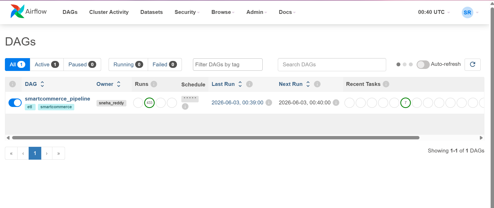

### Airflow - Pipeline Graph (All Tasks Green)
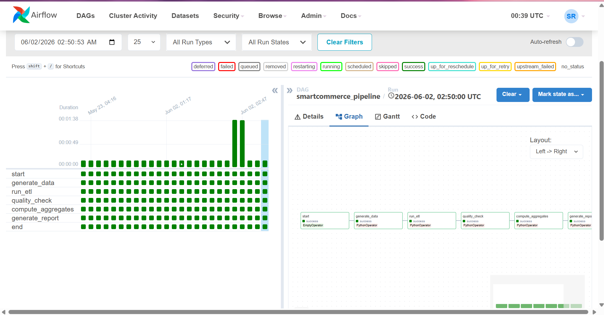

---

## EDA Charts (Matplotlib / Seaborn)

### Monthly Revenue and Orders Trend
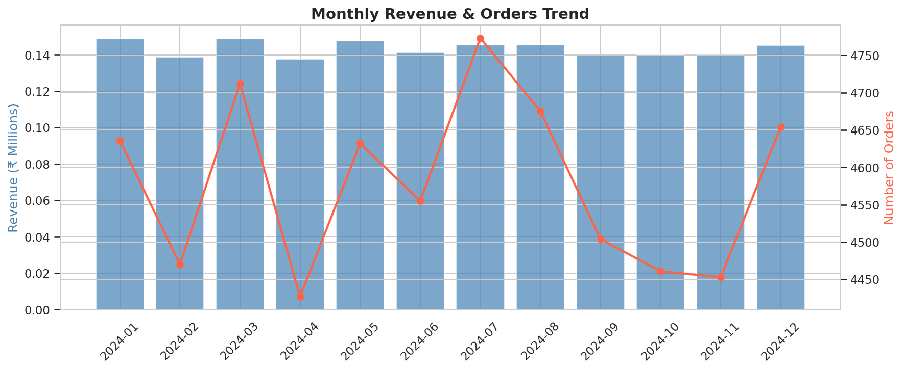

### Revenue by Product Category and Order Share
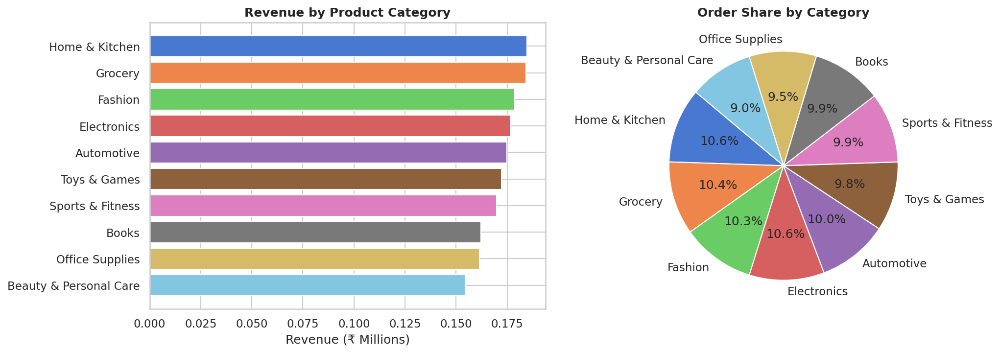

### Revenue by City and Payment Method Distribution
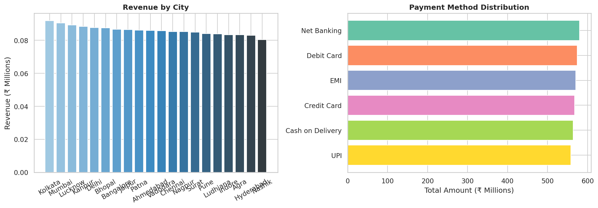

### Order Status Breakdown
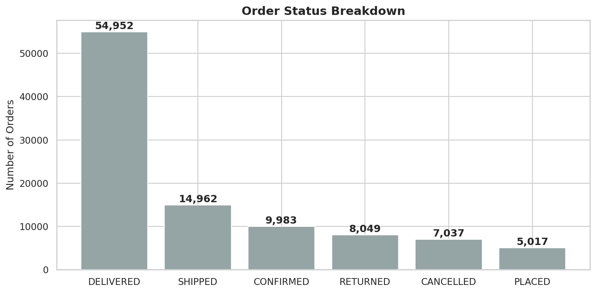

---

## Kafka - Real-time Streaming Dashboard

### Producer + Consumer Live Dashboard
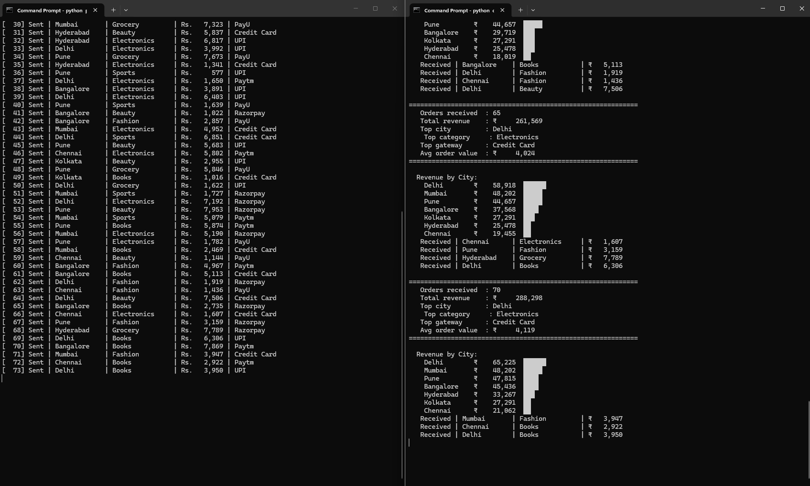
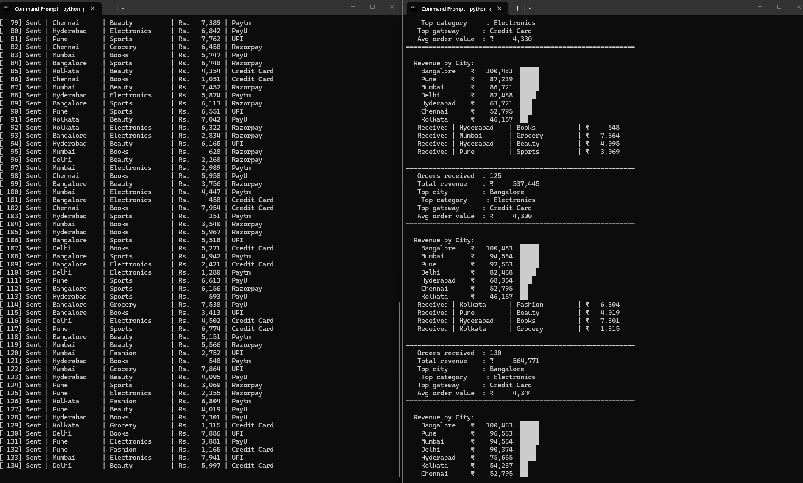
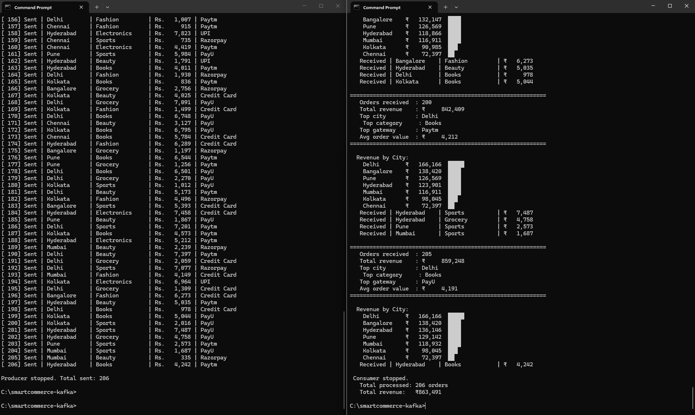

---

## Power BI Dashboard (4 Pages)

### Page 1 - Executive Summary
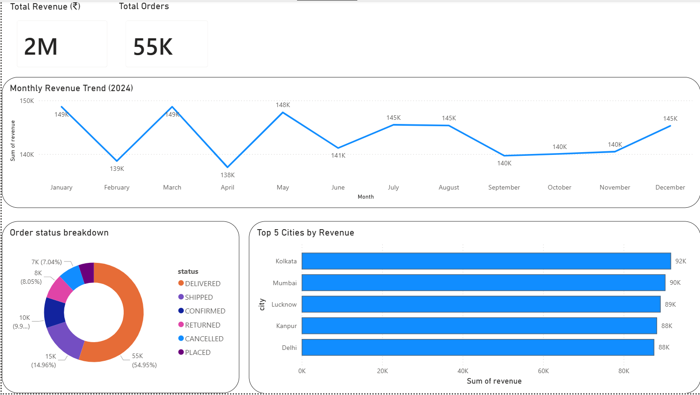

### Page 2 - Product and Category Analysis
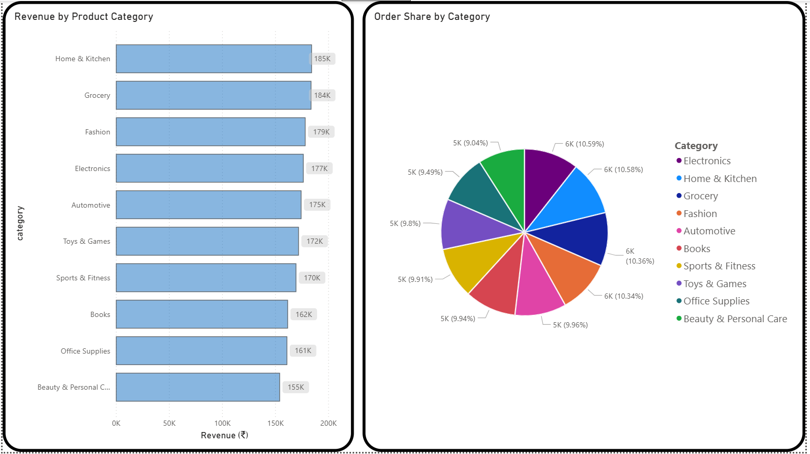

### Page 3 - City and Payments
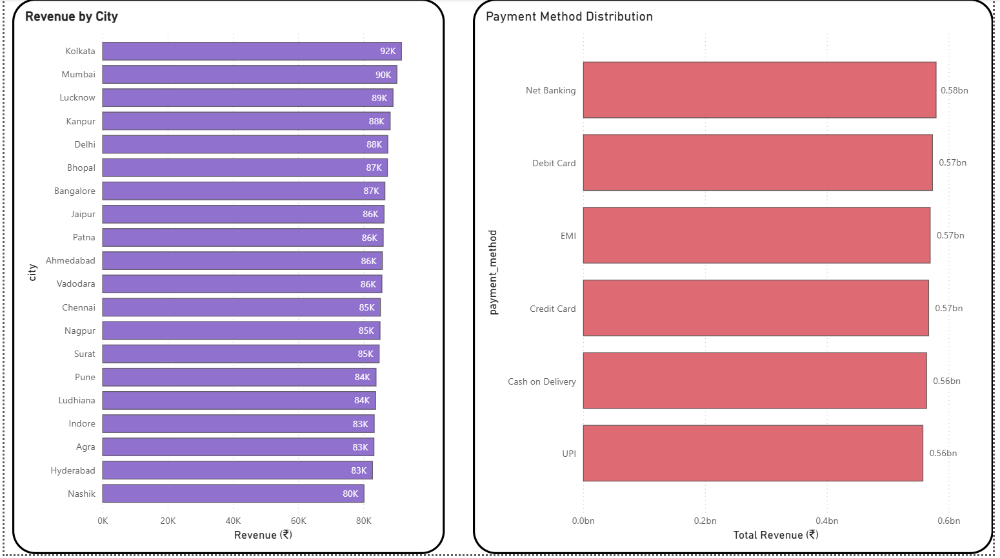

### Page 4 - Customer Segments
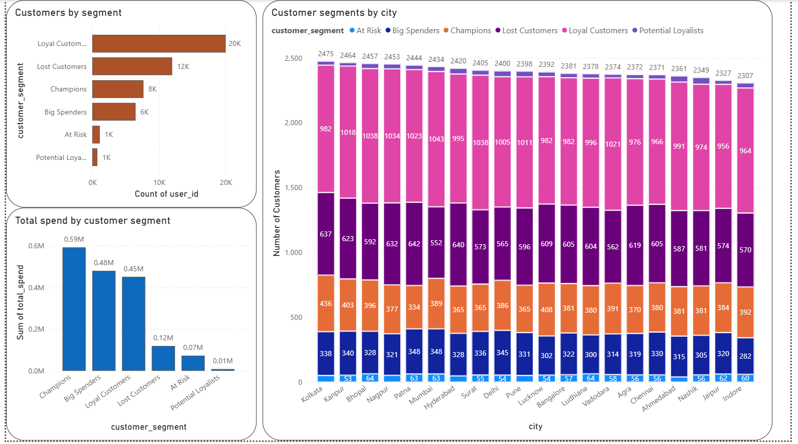

---

## Key Numbers

| Metric | Value |
|---|---|
| Orders processed | 100,000 |
| Order items | 250,000 |
| Users | 10,000 |
| Products | 5,000 |
| Indian cities | 20 |
| Product categories | 10 |
| Airflow DAG runs | 433+ |
| Kafka orders streamed | 206 (demo session) |
| Power BI dashboard pages | 4 |

---

## Key Concepts Demonstrated

- **Lakehouse Architecture** - Bronze/Silver/Gold data layers with Parquet storage
- **Lazy Evaluation** - PySpark builds execution plan before running
- **Broadcast Join** - Small dimension table broadcast to all Spark partitions
- **Partition Pruning** - Parquet partitioned by year/month for faster reads
- **RFM Segmentation** - Customer scoring using Recency, Frequency, Monetary value
- **DAG Orchestration** - Task dependency management with Airflow
- **At-least-once Delivery** - Kafka consumer offset management
- **Containerization** - Full stack reproducibility with Docker Compose

---

## Setup and Running

### Prerequisites
- Docker Desktop installed and running
- Python 3.8+

### Run Airflow Pipeline

```bash
cd docker
docker compose -f airflow-docker-compose.yml up -d
```

Access Airflow UI: http://localhost:8080 (username: admin, password: admin)

### Run Kafka Streaming

```bash
# Terminal 1 - Start Kafka
cd docker
docker compose -f kafka-docker-compose.yml up -d

# Terminal 2 - Start Producer
cd kafka
pip install kafka-python faker
python producer.py

# Terminal 3 - Start Consumer
cd kafka
python consumer.py
```

---

## Author

**Sneha Reddy**
Master in Decision Analytics - Virginia Commonwealth University (School Of Business)
Previously: Software Engineer at Taxila IT Solutions (Java, Spring Boot, Kafka, MySQL, Cassandra)

Linkedin - https://www.linkedin.com/in/sneha-reddy13/
